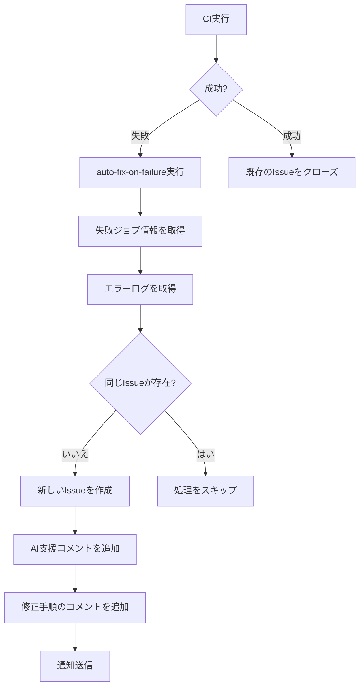
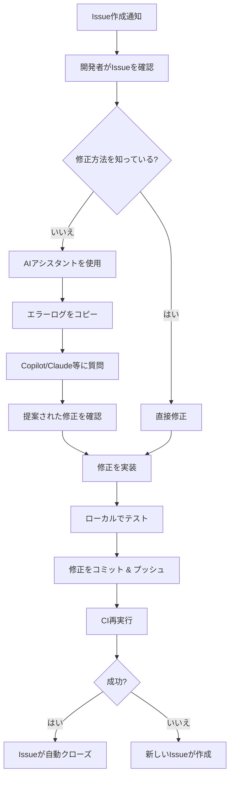

# CI/CD AI統合ガイド

## 概要

CI/CDで失敗した場合に自動でissueを作成し、AIアシスタント（GitHub Copilot、Claude Code等）による支援を促進する仕組みです。

## 質問と回答

### 質問
> CI/CDで失敗した場合は自動でissueをそれに関連して作成して、github copilotにレビューを依頼して、claude codeに対応を依頼するようにできるか？

### 回答: 部分的に可能

## 自動化の範囲

### ✅ 実装可能な機能（既に実装済み）

1. **CI失敗時の自動Issue作成**
   - ワークフロー: `.github/workflows/auto-fix-on-failure.yml`
   - 失敗したジョブの詳細、エラーログを自動収集
   - ワークフロー実行へのリンクを含む

2. **AI利用のための情報提供**
   - GitHub Copilot Chatでの使用方法を記載
   - Claude/Cursorでの使用方法を記載
   - プロンプトテンプレートを提供

3. **自動ラベル付与**
   - `needs-ai-review`: AIレビューを推奨
   - その他: `ci-failure`, `automated`, `bug`, `needs-triage`

4. **自動クローズ**
   - CIが成功したら関連Issueを自動クローズ

### ❌ 自動化できないこと（技術的制約）

1. **GitHub CopilotをAssigneeに設定**
   - **理由**: `@github-copilot`は通常のGitHubユーザーアカウントではない
   - **調査結果**: GitHub APIで確認したが、ユーザーとして存在しない
   - **代替案**: コミット作成者に自動アサイン + Copilot使用を推奨

2. **@mentionによる自動レビュー/対応開始**
   - **GitHub Copilot**: @mentionに自動反応する機能は現時点で存在しない
   - **Claude Code**: @claude-codeユーザーは存在するが、通常のユーザーでBotではない
   - **代替案**: 開発者が手動でAIツールを起動

3. **完全自動修正**
   - AIツールは提案のみで、人間の判断と承認が必要
   - セキュリティとコード品質の観点から、これは意図された設計

## AIアシスタントの使用方法

### GitHub Copilot Chat

Issueが作成されたら、そのIssue上で以下のコマンドを使用できます（Issue番号は不要）:

```
/explain
What caused this CI failure?
```

```
/fix
How can we fix this issue?
```

```
/tests
Generate tests to prevent this regression
```

### Claude / Cursor / その他のAIツール

1. Issueからエラーログをコピー
2. AIアシスタントに以下のプロンプトを使用:

```
I have a CI failure in my TypeScript/Node.js project.

Error details:
[エラーログを貼り付け]

Please:
1. Identify the root cause
2. Suggest a fix with code examples
3. Recommend tests to prevent this issue
4. Explain any potential side effects
```

## ワークフロー

### CI失敗時のフロー



### 修正フロー



## Issue作成の仕組み

### トリガー条件

- CIワークフロー（`.github/workflows/ci.yml`）が失敗
- `workflow_run`イベントで`auto-fix-on-failure.yml`がトリガー
- 同じブランチ・コミットのIssueが存在しない場合のみ作成

### Issueに含まれる情報

1. **基本情報**
   - ブランチ名
   - コミットSHA
   - ワークフロー実行URL
   - 失敗したジョブ数

2. **詳細情報**
   - 各失敗ジョブの名前とステータス
   - 開始・完了時刻
   - ログURL
   - エラーログ（最後の50行）

3. **AI支援情報**
   - GitHub Copilot Chatでの使用方法
   - Claude/Cursorでの使用方法
   - プロンプトテンプレート

4. **修正手順**
   - 手動修正のコマンド例
   - AI支援修正の手順
   - クイック修正テンプレート

## カスタマイズ

### 通知の追加

Slack/Discordへの通知を有効にするには:

1. Repository Secretsに`SLACK_WEBHOOK_URL`を設定
2. `auto-fix-on-failure.yml`の該当セクションが自動的に有効化

### ラベルのカスタマイズ

`.github/workflows/auto-fix-on-failure.yml`の`labels`配列を編集:

```yaml
labels: ['ci-failure', 'automated', 'bug', 'needs-triage', 'needs-ai-review', 'your-custom-label']
```

### エラーログの行数変更

デフォルトは50行ですが、変更可能:

```javascript
const errorLines = logLines.slice(-100).join('\n'); // 100行に変更
```

## ベストプラクティス

1. **Issueを確認したらすぐに対応**
   - CI失敗は他の開発者にも影響する可能性がある
   - `needs-triage`ラベルのIssueを優先的に処理

2. **AIツールを効果的に使用**
   - エラーログだけでなく、関連するコードも提供
   - 複数のAIツールの提案を比較検討

3. **修正後はテストを追加**
   - 同じ問題の再発を防ぐ
   - AIツールにテストケースの生成を依頼

4. **ドキュメントを更新**
   - よくある失敗パターンをドキュメント化
   - 将来の参考のため

## トラブルシューティング

### Issueが作成されない

- ワークフローの権限を確認: `permissions.issues: write`
- CIワークフローの名前が一致しているか確認
- 同じIssueが既に存在していないか確認

### エラーログが取得できない

- ジョブログのダウンロード権限を確認
- ログが大きすぎる場合、GitHub APIの制限に引っかかる可能性

### 自動クローズが動作しない

- Issue作成時のタイトルフォーマットが一致しているか確認
- ラベルが正しく付与されているか確認

## 関連ドキュメント

- [GitHub Actions: workflow_run](https://docs.github.com/en/actions/using-workflows/events-that-trigger-workflows#workflow_run)
- [GitHub Copilot Chat](https://docs.github.com/en/copilot/using-github-copilot/asking-github-copilot-questions-in-your-ide)
- [GitHub REST API: Issues](https://docs.github.com/en/rest/issues)

## 更新履歴

- 2025-10-25: AI統合の調査結果を反映、`needs-ai-review`ラベルを追加
- 初版: 基本的なCI失敗時のIssue作成機能を実装
